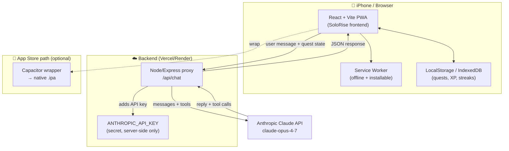
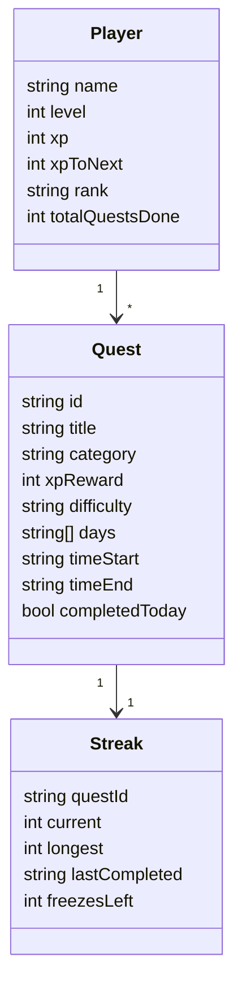
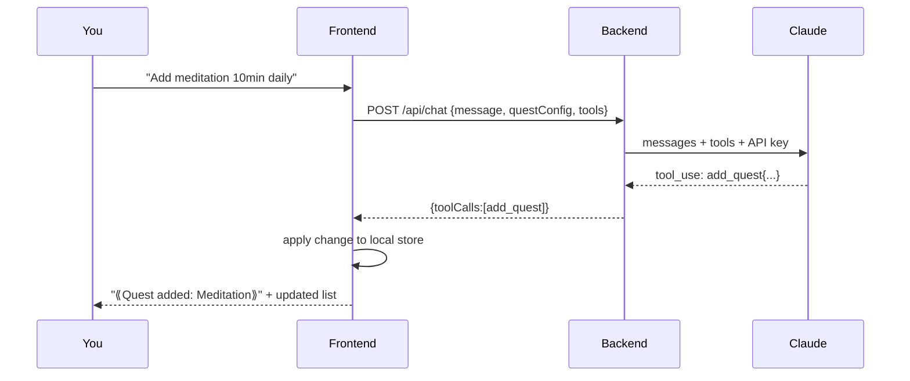
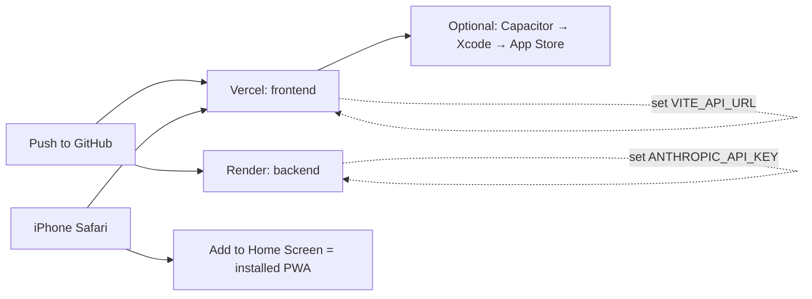

# SoloRise — Planning Document

A Solo Leveling-inspired self-improvement system. You are the "Player". Real-life
habits (gym, swimming, looksmaxing, study) become **Quests**. Completing them grants
**XP**, raises your **Rank** (E → D → C → B → A → S), and keeps your **streaks** alive.
An AI "System" (powered by the Claude API) talks to you, motivates you, and lets you
reconfigure quests by chatting in natural language.

---

## 1. Goals

| # | Requirement | How it's met |
|---|-------------|--------------|
| 1 | Solo Leveling theme | Dark "System" UI, ranks, levels, XP, glowing blue panels |
| 2 | Gym streak / motivation | Streak counter with fire icon, streak freeze, daily reminders |
| 3 | Looksmaxing tracker | Dedicated quest category (skincare, grooming, posture, mewing) |
| 4 | Daily quests | Recurring quests with schedules (e.g. swimming Tue/Thu/Fri 5–6 PM) |
| 5 | Chatbot to reconfigure | Claude API chat that can read/modify your quest config via tool-calling |
| 6 | iOS app | PWA first (installable on iPhone), then Capacitor wrapper for the App Store |
| 7 | Claude API for everything AI | Single backend proxy holding the API key |

---

## 2. Architecture



**Why this split?** The Claude API key must NEVER live in the frontend (anyone could
steal it from the browser). So a tiny backend holds the key and forwards requests.
Everything else (quest data, XP, streaks) lives on-device so the app works offline.

---

## 3. Tech Stack

- **Frontend:** React 18 + Vite + TypeScript, Tailwind CSS, Framer Motion (animations), lucide-react (icons), Zustand (state), `vite-plugin-pwa` (installable).
- **Backend:** Node.js + Express, `@anthropic-ai/sdk`, `dotenv`, `cors`.
- **AI model:** `claude-opus-4-7` (chat + tool-calling to edit config).
- **Storage:** Browser localStorage (simple) → upgrade to IndexedDB if needed.
- **iOS packaging:** PWA (install from Safari) → Capacitor for native App Store build.
- **Deploy:** Frontend on Vercel, backend on Render/Railway (or both on Vercel via serverless).

---

## 4. Data Model



**Categories:** `gym`, `looksmaxing`, `study`, `cardio`, `mind`, `custom`.

**Rank thresholds (by level):** E (1–4), D (5–9), C (10–19), B (20–34), A (35–54), S (55+).

**XP curve:** `xpToNext = 100 * level * 1.25` (rounded). Completing a quest grants
its `xpReward`; difficulty maps Easy=15, Medium=30, Hard=60, Boss=120.

**Default quests seeded for you:**
- Gym session — gym, Hard, Mon/Wed/Fri/Sat
- Swimming — cardio, Medium, **Tue/Thu/Fri 17:00–18:00**
- Looksmaxing routine (skincare + grooming) — looksmaxing, Easy, daily
- Posture / mewing check — looksmaxing, Easy, daily
- Deep study block — study, Hard, daily

---

## 5. Feature Detail

### 5.1 Quest System
Daily quests reset at local midnight. A quest shows up "active" only on its scheduled
days. Completing it: plays an XP animation, increments streak, may trigger level-up
("⟪LEVEL UP⟫" overlay) and rank-up panels.

### 5.2 Streaks & Motivation
Each quest tracks current + longest streak. Missing a scheduled day breaks the streak
unless a **streak freeze** is used (you get 2/month). A global "daily login" streak
also exists. Fire-icon intensity scales with streak length.

### 5.3 Looksmaxing
Own category with sub-checklist: skincare AM/PM, hydration, grooming, posture, sleep.
Tracked like any quest but grouped on its own screen with a weekly progress ring.

### 5.4 AI System Chat (Claude)
A chat panel where "The System" speaks. The frontend sends your message **plus your
current quest config** to `/api/chat`. Claude is given **tools** it can call:
- `add_quest`, `edit_quest`, `delete_quest`, `get_config`.
When Claude calls a tool, the backend returns the tool definition result and the
frontend applies the change locally. So you can say *"add a 10 min meditation quest
every morning"* and it appears.



### 5.5 iOS Support
- **Phase 1 — PWA:** add manifest + service worker. Open site in Safari → Share →
  "Add to Home Screen". Runs fullscreen like an app. Works offline.
- **Phase 2 — Native (App Store):** wrap with Capacitor (`npx cap add ios`), open in
  Xcode, sign with Apple Developer account ($99/yr), submit.

---

## 6. Folder Structure

```
solorise/
├── planning.md
├── README.md
├── package.json
├── vite.config.ts
├── tailwind.config.js
├── tsconfig.json
├── index.html
├── public/
│   ├── manifest.webmanifest
│   ├── icon-192.png
│   └── icon-512.png
├── src/
│   ├── main.tsx
│   ├── App.tsx
│   ├── index.css
│   ├── store/
│   │   └── useGameStore.ts      # Zustand: player, quests, streaks, XP logic
│   ├── lib/
│   │   ├── ranks.ts             # rank + XP curve helpers
│   │   └── api.ts               # calls backend /api/chat
│   ├── components/
│   │   ├── StatusWindow.tsx     # player HUD (level/rank/XP bar)
│   │   ├── QuestCard.tsx
│   │   ├── QuestList.tsx
│   │   ├── StreakBadge.tsx
│   │   ├── LooksmaxPanel.tsx
│   │   ├── LevelUpOverlay.tsx
│   │   └── SystemChat.tsx       # Claude chatbot panel
│   └── screens/
│       ├── HomeScreen.tsx
│       ├── QuestsScreen.tsx
│       ├── LooksmaxScreen.tsx
│       └── ChatScreen.tsx
└── server/
    ├── package.json
    ├── .env.example             # ANTHROPIC_API_KEY=...
    └── index.js                 # Express proxy → Claude API
```

---

## 7. Execution (local dev)

```bash
# 1. Frontend
cd solorise
npm install
npm run dev          # opens http://localhost:5173

# 2. Backend (separate terminal)
cd solorise/server
npm install
cp .env.example .env # then paste your real ANTHROPIC_API_KEY
npm start            # runs http://localhost:8787
```

The frontend's `src/lib/api.ts` points to the backend URL. In dev it uses
`http://localhost:8787/api/chat`; in production set `VITE_API_URL` to your deployed
backend.

---

## 8. Deployment



1. **Backend (Render/Railway):** new Web Service from your repo, root `server/`,
   build `npm install`, start `node index.js`, add env var `ANTHROPIC_API_KEY`.
2. **Frontend (Vercel):** import repo, framework Vite, add env var `VITE_API_URL`
   = your Render URL. Deploy → you get `https://solorise.vercel.app`.
3. **Install on iPhone (PWA):** open that URL in Safari → Share → Add to Home Screen.
4. **App Store (optional native):** `npm i @capacitor/core @capacitor/cli`,
   `npx cap init`, `npx cap add ios`, `npm run build && npx cap sync`,
   `npx cap open ios` → run/archive in Xcode → submit to App Store Connect.

---

## 9. Security Notes
- API key lives ONLY in backend env vars — never in frontend code or git.
- Backend restricts CORS to your frontend origin.
- All quest data is local to the device (private by default).

---

## 10. Roadmap / Future
- Cloud sync (Supabase) for multi-device.
- Push notifications for quest reminders (native iOS via Capacitor).
- Boss battles (weekly challenges), guild/leaderboard with friends.
- Photo log for looksmaxing progress.
